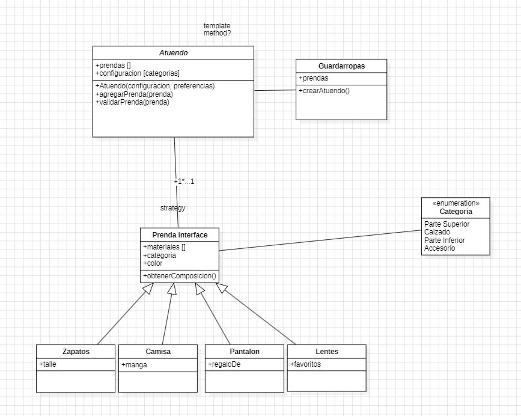

# Que me pongo?
Ejercicio Que me pongo de Diseño de Sistemas UTN

Primera iteracion


## Diagrama de clases


### primer diagrama


### segundo diagrama (despues de implementar algo de codigo)

(todavia no lo hice :) ) 


[Enunciado 1](src/main/resources/enunciado/qmp1.pdf)


## Algunas dudas...

1. En Prenda tengo el atributo "material" que lo defini como un enum porque entiendo que podria ser Tela, cuero , etc. Por ahora lo deje asi

```java 
import Guardarropas.TipoPrenda;

public abstract class Prenda {
    private TipoPrenda tipoPrenda;
    private String material; // <--
    private String colorPrincipal;
    private String colorSecundario;

}
```

2. Color. Todavia no se termino de definir, entiendo que se busca una abstraccion tal vez mas acotada, al momento no se termina de entender para que se va a usar, puedo definirlo como un ENUM o como un String por ahora.
Yo lo defini como un string, para despues poder usar algun formato Hex, pero por como viene el ejercicio de "AZUL_GASTADO" probablemente termine siendo un enum.


## Decisiones

#### 1.  Validaciones
Las validaciones las agregue en otro package donde trate de centralizar algunas cosas que a futuro entiendo que pueden aplicar en varios lugares.


#### 2.  Guardarropas

Necesito en algun lado tener la base de conocimiento de las prendas que tiene una persona o grupo de personas. Para eso cree la abstraccion Guardarropa para poder guardar un conjunto de prendas. En este caso le cree dos cosntructores, porque puede que el guardarropas arranque vacio o con algunas prendas. No creo que sea importante al caso pero lo menciono.

```java
    public Guardarropas() {
        this.prendas = new ArrayList<>();
    }

    public Guardarropas(ArrayList<Prenda> prendas) {
        this.prendas = prendas;
    }
```

#### 3. Tipo de prenda

Estuve bastante dubitativo en crear o no esto y finalmente me decidi que si. El porque, es basicamente porque puedo llegar a tener dos prendas como "CamisaMangaLarga" y "CamisaMangaCorta" y el tipo de Prenda seria "Camisa" 
Capaz en la proxima iteracion esto muere, pero por ahora lo dejo.